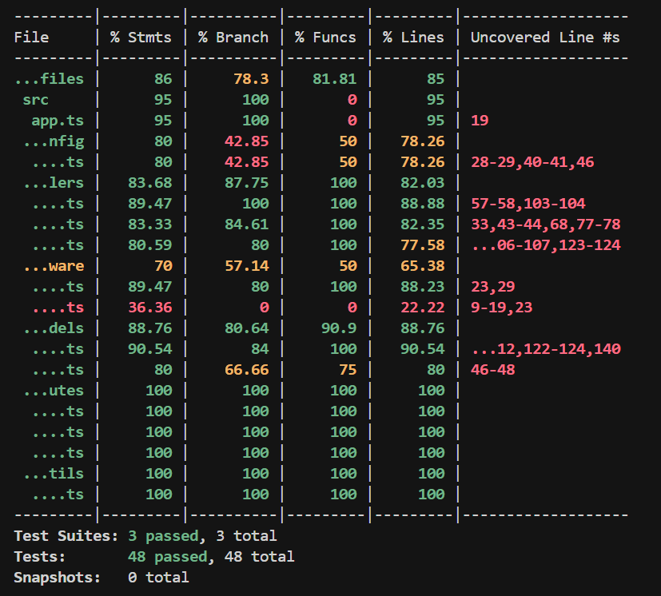
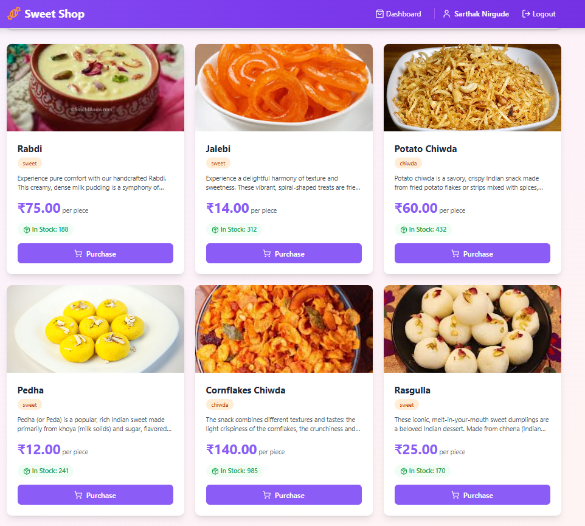
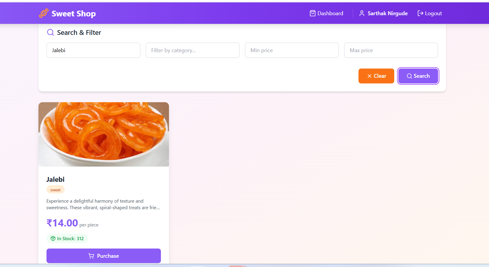
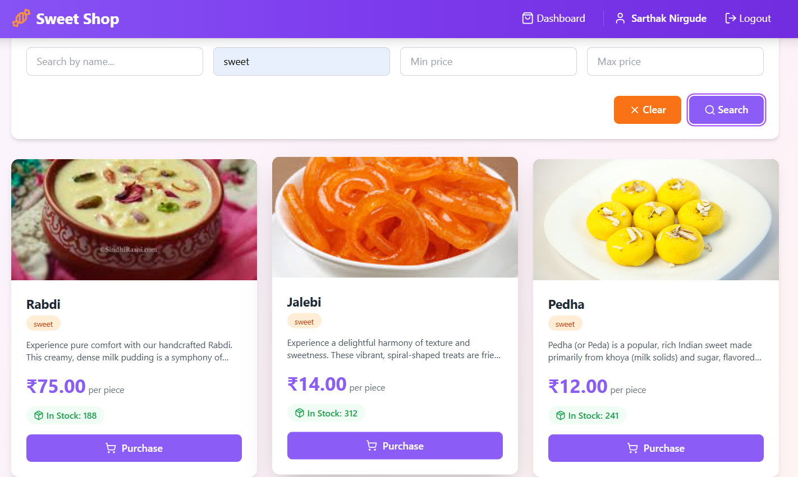
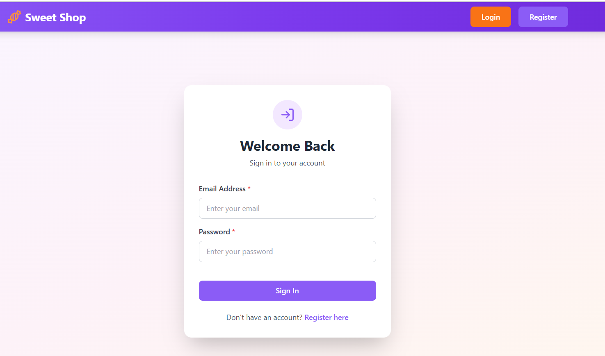
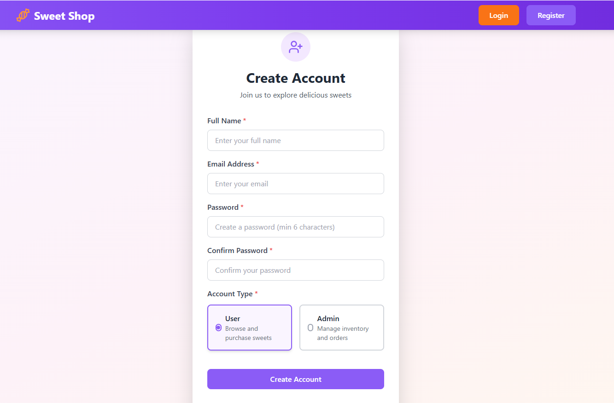
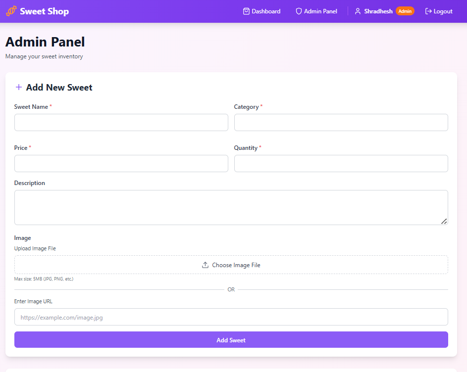
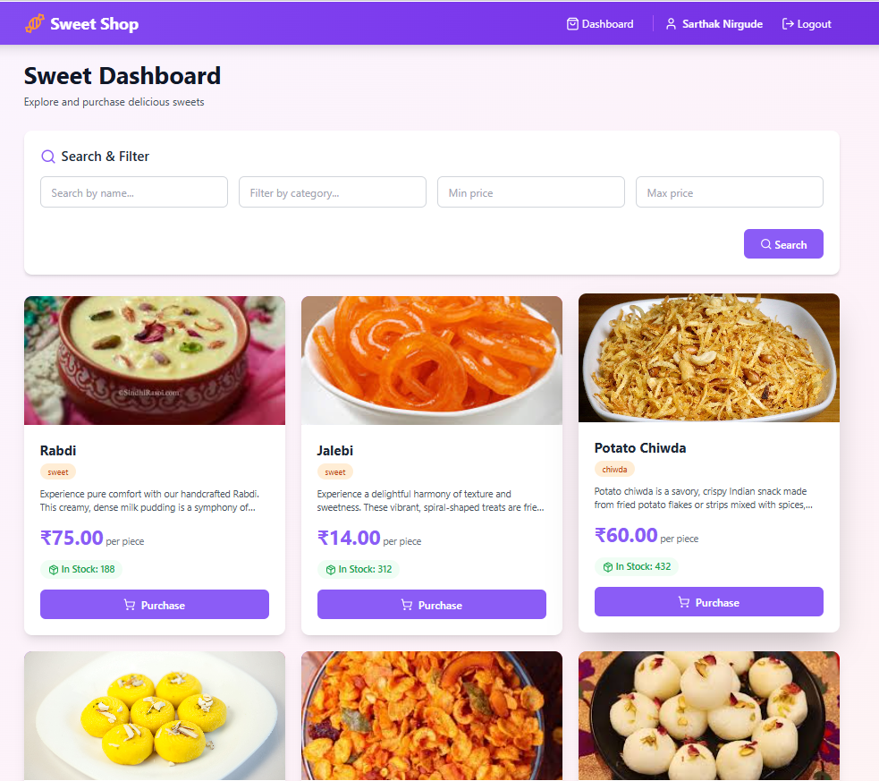

# Sweet Shop Management System

A full-stack web application for managing a sweet shop inventory, allowing users to browse, search, and purchase sweets, with role-based access control for administrators to manage the inventory.

# Screeshots
<p align="center">
  
  
</p>
<p align="center">
  
  
</p>
<p align="center">
  
  
</p>
<p align="center">
  
  
</p>
## Table of Contents

- [Project Overview](#project-overview)
- [Features](#features)
- [Tech Stack](#tech-stack)
- [Prerequisites](#prerequisites)
- [Local Setup](#local-setup)
  - [Backend Setup](#backend-setup)
  - [Frontend Setup](#frontend-setup)
- [Running the Application](#running-the-application)
- [Testing](#testing)
- [Screenshots](#screenshots)
- [Project Structure](#project-structure)
- [API Documentation](#api-documentation)

---

##  Project Overview

The Sweet Shop Management System is a comprehensive inventory management solution designed for sweet shops. It provides:

- **User Authentication**: Secure registration and login with JWT-based authentication
- **Role-Based Access Control**: Separate interfaces for regular users and administrators
- **Inventory Management**: Create, read, update, and delete sweet items (admin only)
- **Search & Filter**: Advanced search functionality by name, category, and price range
- **Purchase System**: Users can purchase sweets with automatic inventory updates
- **Restock Management**: Admins can restock inventory items
- **Image Support**: Upload and display images for sweet items
- **Responsive Design**: Modern UI built with Tailwind CSS

---

##  Features

### For Regular Users
-  User registration and authentication
-  Search and filter sweets by name, category, and price
-  Purchase sweets with quantity selection
-  View sweet details including images, descriptions, and prices
-  Responsive design for desktop

### For Administrators
-  Admin registration and authentication
-  Create new sweet items with images
-  Update existing sweet details
-  Delete sweet items
-  Restock inventory
-  Manage entire inventory from admin panel

---

##  Tech Stack

### Backend
- **Runtime**: Node.js (v18+)
- **Language**: TypeScript (v5.9.3)
- **Framework**: Express.js (v4.18.2)
- **Database**: PostgreSQL (v14+)
- **ORM/Database Driver**: pg (v8.11.3)
- **Authentication**: JWT (jsonwebtoken v9.0.2)
- **Password Hashing**: bcryptjs (v2.4.3)
- **Security**: Helmet (v7.1.0), CORS (v2.8.5)
- **Environment Variables**: dotenv (v16.3.1)
- **Testing**: Jest (v29.7.0), Supertest (v6.3.4), ts-jest (v29.4.6)

### Frontend
- **Framework**: React (v18.2.0)
- **Language**: TypeScript (v4.9.5)
- **Build Tool**: Create React App (react-scripts v5.0.1)
- **Routing**: React Router DOM (v6.30.2)
- **Styling**: Tailwind CSS (v3.4.19)
- **HTTP Client**: Axios (v1.13.2)
- **Icons**: Lucide React (v0.294.0)
- **PostCSS**: PostCSS (v8.5.6), Autoprefixer (v10.4.22)

### DevOps & Deployment
- **Containerization**: Docker, Docker Compose
- **Database Migration**: Custom TypeScript migration scripts
- **CI/CD Ready**: Structured for deployment on platforms like Render

---

##  Prerequisites

Before you begin, ensure you have the following installed on your machine:

1. **Node.js** (v18.0.0 or higher)
   - Download from [nodejs.org](https://nodejs.org/)
   - Verify installation: `node --version`

2. **npm** (comes with Node.js)
   - Verify installation: `npm --version`

3. **PostgreSQL** (v14 or higher)
   - Download from [postgresql.org](https://www.postgresql.org/download/)
   - Verify installation: `psql --version`

4. **Git** (optional, for cloning the repository)
   - Download from [git-scm.com](https://git-scm.com/)

---

##  Local Setup

### Step 1: Clone the Repository

```bash
git clone <your-repository-url>
cd sweet-shop-mgmt/sweet_shop_mgmt
```

### Step 2: Database Setup

1. **Start PostgreSQL service**
   ```bash
   # On Windows (if installed as service, it should be running automatically)
   # On macOS
   brew services start postgresql
   # On Linux
   sudo systemctl start postgresql
   ```

2. **Create the database**
   ```bash
   # Connect to PostgreSQL
   psql -U postgres
   
   # Create the database
   CREATE DATABASE sweets_db;
   
   # Create test database (for running tests)
   CREATE DATABASE sweets_db_test;
   
   # Exit psql
   \q
   ```

3. **Create a user (optional, if not using default postgres user)**
   ```bash
   psql -U postgres
   CREATE USER your_username WITH PASSWORD 'your_password';
   GRANT ALL PRIVILEGES ON DATABASE sweets_db TO your_username;
   GRANT ALL PRIVILEGES ON DATABASE sweets_db_test TO your_username;
   \q
   ```

---

## 🔧 Backend Setup

1. **Navigate to backend directory**
   ```bash
   cd backend
   ```

2. **Install dependencies**
   ```bash
   npm install
   ```

3. **Configure environment variables**
   
   Create a `.env` file in the `backend` directory:
   ```env
   # Database Configuration
   DB_HOST=localhost
   DB_PORT=5432
   DB_NAME=sweets_db
   TEST_DB_NAME=sweets_db_test
   DB_USER=postgres
   DB_PASSWORD=your_password
   
   # JWT Configuration
   JWT_SECRET=your_super_secret_jwt_key_change_this_in_production
   
   # Server Configuration
   PORT=3000
   NODE_ENV=development
   ```

   **Important**: Replace `your_password` and `your_super_secret_jwt_key_change_this_in_production` with your actual values.

4. **Build TypeScript code**
   ```bash
   npm run build
   ```

5. **Start the development server**
   ```bash
   npm run dev
   ```

   The backend server will start on `http://localhost:3000`

   You should see:
   ```
   Database connected successfully
   Server running on port 3000
   Environment: development
   Database tables initialized successfully
   ```

---

##  Frontend Setup

1. **Open a new terminal and navigate to frontend directory**
   ```bash
   cd frontend
   ```

2. **Install dependencies**
   ```bash
   npm install
   ```

3. **Configure environment variables (optional)**
   
   Create a `.env` file in the `frontend` directory if you need to customize the API URL:
   ```env
   REACT_APP_API_URL=http://localhost:3000/api
   ```

   By default, the frontend is configured to connect to `http://localhost:3000/api`.

4. **Start the development server**
   ```bash
   npm start
   ```

   The frontend will automatically open in your browser at `http://localhost:3001` (or another port if 3001 is busy).

---

##  Running the Application

### Development Mode

1. **Start the database** (if not already running)
   ```bash
   # Ensure PostgreSQL is running
   ```

2. **Start the backend server** (Terminal 1)
   ```bash
   cd backend
   npm run dev
   ```

3. **Start the frontend server** (Terminal 2)
   ```bash
   cd frontend
   npm start
   ```

4. **Access the application**
   - Frontend: http://localhost:3001
   - Backend API: http://localhost:3000/api

### Production Mode

1. **Build the backend**
   ```bash
   cd backend
   npm run build
   ```

2. **Start the backend**
   ```bash
   npm start
   ```

3. **Build the frontend**
   ```bash
   cd frontend
   npm run build
   ```

4. **Serve the frontend** (using a static server like `serve`)
   ```bash
   npm install -g serve
   serve -s build
   ```

---

##  Testing

### Backend Tests

1. **Navigate to backend directory**
   ```bash
   cd backend
   ```

2. **Ensure test database exists** (see Database Setup section)

3. **Run tests**
   ```bash
   npm test
   ```

4. **Run tests with coverage**
   ```bash
   npm run test:coverage
   ```

5. **Run tests in watch mode**
   ```bash
   npm run test:watch
   ```

### Frontend Tests

1. **Navigate to frontend directory**
   ```bash
   cd frontend
   ```

2. **Run tests**
   ```bash
   npm test
   ```

---

## 📸 Screenshots

<!-- Screenshots will be added here -->

---

##  Project Structure

```
sweet_shop_mgmt/
├── backend/
│   ├── src/
│   │   ├── config/          # Database configuration
│   │   ├── controllers/     # Route controllers
│   │   ├── middleware/      # Auth & error middleware
│   │   ├── migrations/      # Database migrations
│   │   ├── models/          # Data models
│   │   ├── routes/          # API routes
│   │   ├── types/           # TypeScript type definitions
│   │   ├── utils/           # Utility functions
│   │   └── server.ts        # Server entry point
│   ├── tests/               # Test files
│   ├── dist/                # Compiled JavaScript (generated)
│   ├── Dockerfile           # Docker configuration
│   ├── package.json         # Backend dependencies
│   └── tsconfig.json        # TypeScript configuration
│
├── frontend/
│   ├── src/
│   │   ├── components/      # React components
│   │   │   ├── auth/        # Authentication components
│   │   │   ├── common/      # Reusable components
│   │   │   ├── layout/      # Layout components
│   │   │   └── sweets/      # Sweet-related components
│   │   ├── context/         # React Context providers
│   │   ├── hooks/           # Custom React hooks
│   │   ├── pages/           # Page components
│   │   ├── services/        # API services
│   │   ├── types/           # TypeScript type definitions
│   │   ├── utils/           # Utility functions
│   │   └── App.tsx          # Main App component
│   ├── public/              # Static files
│   ├── Dockerfile           # Docker configuration
│   ├── package.json         # Frontend dependencies
│   └── tailwind.config.js   # Tailwind CSS configuration
│
├── docker-compose.yml       # Docker Compose configuration
├── docker-compose.dev.yml   # Development override
├── docker-start.sh          # Startup script (Linux/Mac)
├── docker-start.bat         # Startup script (Windows)
├── README.md                # This file
└── README.Docker.md         # Docker deployment guide
```

---

##  API Documentation

### Base URL
```
http://localhost:3000/api
```

### Authentication Endpoints

#### Register User
```http
POST /api/auth/register
Content-Type: application/json

{
  "name": "John Doe",
  "email": "john@example.com",
  "password": "SecurePass123!",
  "role": "user" // optional, defaults to "user"
}
```

#### Login
```http
POST /api/auth/login
Content-Type: application/json

{
  "email": "john@example.com",
  "password": "SecurePass123!"
}
```

### Sweet Management Endpoints

#### Get All Sweets
```http
GET /api/sweets
Authorization: Bearer <token>
```

#### Search Sweets
```http
GET /api/sweets/search?name=chocolate&category=Indian&minPrice=50&maxPrice=100
Authorization: Bearer <token>
```

#### Create Sweet (Authenticated)
```http
POST /api/sweets
Authorization: Bearer <token>
Content-Type: application/json

{
  "name": "Gulab Jamun",
  "category": "Indian",
  "price": 50.00,
  "quantity": 100,
  "description": "Delicious Indian sweet",
  "image_url": "https://example.com/image.jpg" // optional
}
```

#### Update Sweet (Authenticated)
```http
PUT /api/sweets/:id
Authorization: Bearer <token>
Content-Type: application/json

{
  "name": "Gulab Jamun Premium",
  "price": 60.00,
  "quantity": 150
}
```

#### Delete Sweet (Admin Only)
```http
DELETE /api/sweets/:id
Authorization: Bearer <admin_token>
```

### Inventory Endpoints

#### Purchase Sweet
```http
POST /api/sweets/:id/purchase
Authorization: Bearer <token>
Content-Type: application/json

{
  "quantity": 5
}
```

#### Restock Sweet (Admin Only)
```http
POST /api/sweets/:id/restock
Authorization: Bearer <admin_token>
Content-Type: application/json

{
  "quantity": 50
}
```

---

##  Security Features

- JWT-based authentication
- Password hashing with bcryptjs
- Helmet.js for security headers
- CORS configuration
- Input validation
- SQL injection protection (parameterized queries)
- Role-based access control


---


##  Author

Shradhesh Gaikwad

---


